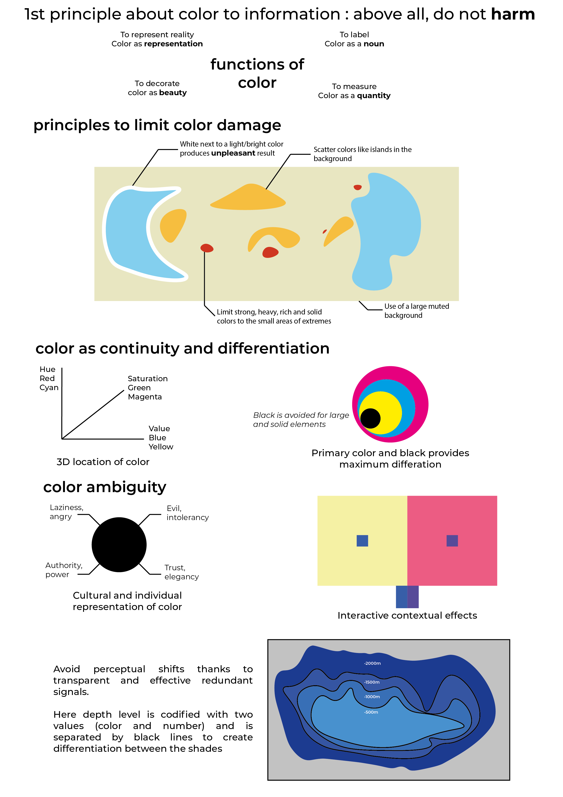

# Color and Visualization
### Edward Tufte

In its remarkable book *Visual Display of Quantitative Information* paper, Edward Tufte a chapter to the tough use of color in visualizations.  
Tough because color can be easily harmful and produce an unpleasant result. By comparing examples, E. Tufte presents some thumb rules to deal with colors and the pitfalls to not fall in.

**[Link to book](https://www.edwardtufte.com/tufte/books_vdqi)**

**[Link to full viz](images/RE04_Tufte_PELLIER_A4.png)**

## First principle : DO NOT HARM

---

## Principles to limit color damage

---

## Color as continuity and differentiation

---

## Color ambiguity

---

## Avoid the Perceptual Shifts

---

