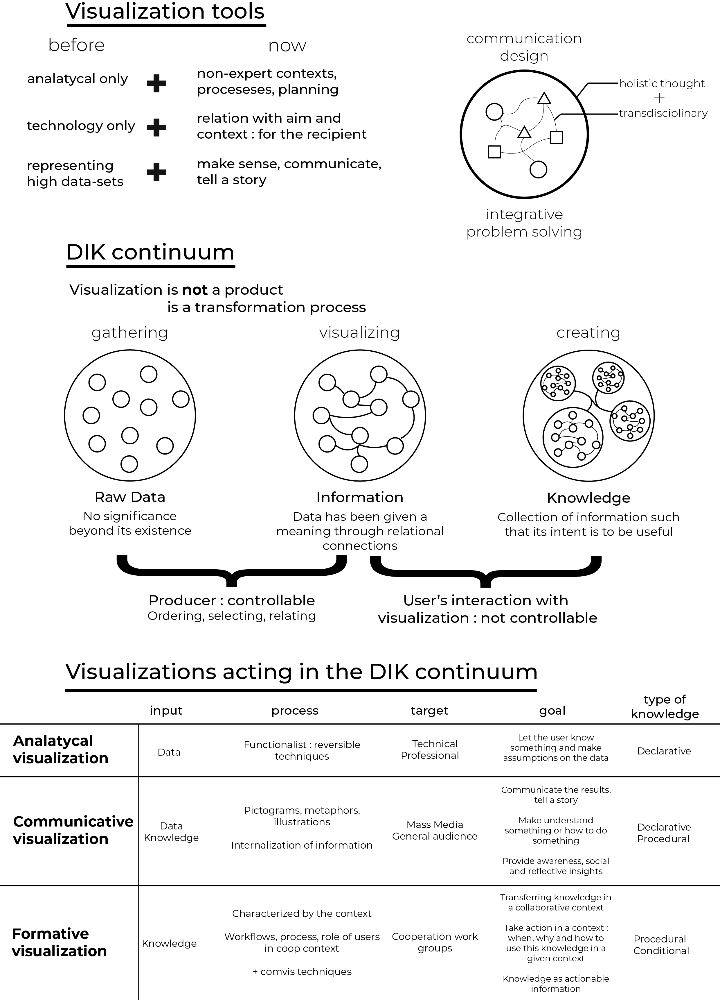

# From Data to Knowledge - Visualizations as Transformation Processes within the Data-Information-Knowledge Continuum
### Luca Masud et al.

In this paper, visualization is presented as a communication tool and a transformation process. In the Data-Information-Knowledge continuum, visualizations are what give meaning to data and therefore understanding.

**[Link to full viz](images/RE03_Masud_PELLIER_A4.jpg)**

## Vizualization tools : now & before

---

## The Data-Information-Knowledge continuum

---

## Visualizations acting in the DIK continuum

---

