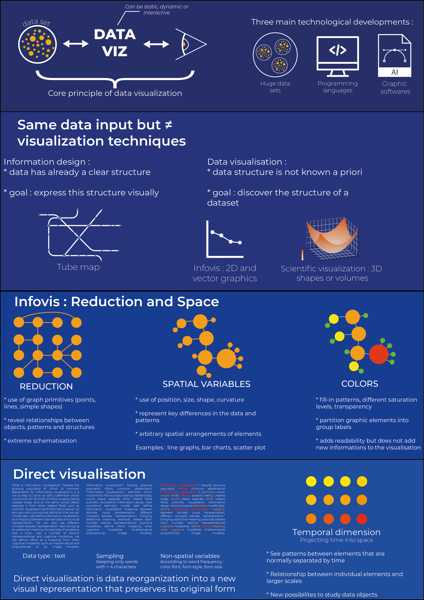

# What is Visualization ?
### Lev Manovich

In this paper, Lev Manovich gives a broad understanding of what is visualization. From its core principles to the distinction between infoviz and dataviz. Manovich also gives a clear definition of what is direct visualization, a way of presenting data through a new visual representation that preserves data's original form.

**[Link to full viz](images/RE02_Manovich-PELLIER_A4.png)**

## What is Visualization ?

---

## The Difference Between Infoviz and Dataviz

---

## Infoviz: Reduction & Space

---

## Direct Visualization

---

